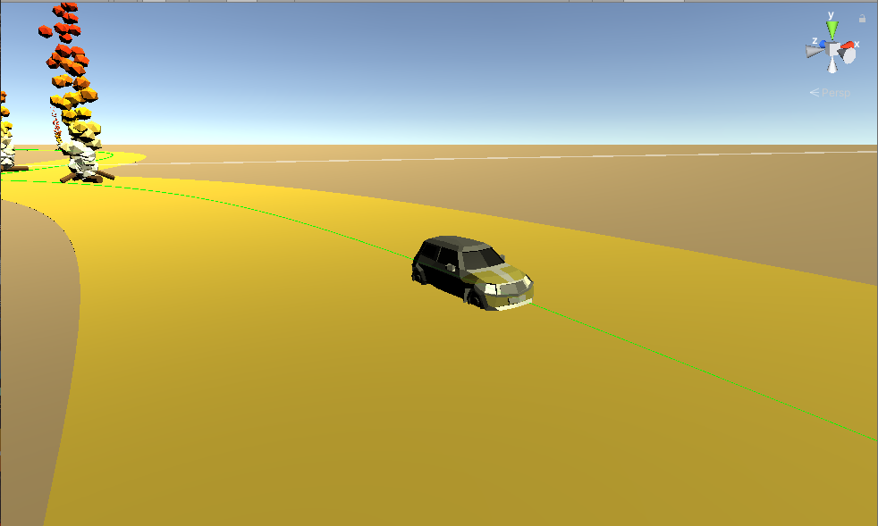

# The Gathering 2020 AI competition: Gaia Edition (Preview edition)




Note that this is a beta of the final version, towards April the game will be **much** more polished! :)

Expect changes to the readme up and throughout march. As well as some major feature updates. For example the missing UI parts.

The point of this release is to show off the protocol so that everyone that wished may start working. We will **not** break any implementation that you are working on right now, but we may add more commands. Either for finer control of the vehicle or easier control for more novice players.

We might tweak some values based on some more playtesting up until the 1st of March ish.
We will also tweak the speed falloff when leaving the road, at the moment its a bit to steep

## What are we going to do?

The challenge is simple, you are going to drive a car around a track as fast as possible!


## Prizes

- 1st: 4000kr
- 2nd: 3000kr
- 3rd: 2000kr

## Rules

### General Rules apply

### Competition Rules

* Minimum five competitors is needed
* Do not interact with the computer outside of the websocket server
* The rules may change within reasonable limits


#### Score/Rank system

The system has not been decided, will be published as soon as we figure out how we want to do it. 
Regardless, the point is to complete the track as fast as possible.

## The protocol

The protocol is based on JSON packets over WebSockets.

This approach was chosen due to the fact that almost all _reasonable_ languages supports these two concepts either natively or via a mature 3rd party package.

##### Languages which we will support

###### Python

Atleast websocket_client
https://pypi.org/project/websocket_client/

###### Javascript (TypeSript?)

###### Java/ Kotlin

###### C#

Websocket-sharp and JSON.Net will be avaliable

https://github.com/sta/websocket-sharp
https://www.newtonsoft.com/json

###### Others

You can use whatever you want of languages, but these are the ones i'm ready to compile/run.
Contact me if you want to use something else, and/or got reasonable library needs.

### Examples

More examples will come!
**Python:** https://github.com/N0K0/AiCompo2020-bots

### Connecting to the server

The Unity application automatically sets up an Websocket Server on `ws://localhost:8888/` with the service running on `ws://localhost:8888/server`

You will soon be greeted with a bunch of spam asking for an username.
Check out the examples if something is unclear.

### State sent to the player

There is two different types of state sent to the use.

The first one is the definition of the game map. As precisely as possible. Since this might be quite big I opt on only sending it a couple of times. At the start of the game you will get 10 seconds to parse the input data   and start figuring out the path.

#### The game map

The game map is procedurally generated from 3 to 10 points on a map, with bezier curves drawn between them. The map is completely flat and you may only collide with the ground. Simply ignore the y keys that is passed to you as the player. 

See the first video from here if you wonder how the curves work

https://www.youtube.com/playlist?list=PLFt_AvWsXl0d8aDaovNztYf6iTChHzrHP

### Commands and messages

In general all commands will return a couple of different answers, all basic commands return an OK or ERROR. Other than that we will return things like a bit more comprehensive status or such.


The two basic returns are `OK` and `ERROR`.

Both are based on the Type field which is the same as the command sent. And a status field with the value  `OK` or `ERROR` on top of that the `Command`  field is used for some debug friendly strings

```json
{
	"Type": "Username",
        "Status": "OK",
	"Command": "Username set!"
}
```

```json
{
	"Type": "Username",
        "Status": "ERROR",
	"Command": "Username already in use, set an other if "

}
```


The Messages are two parted. The first part is this outer part which looks like the two messages above.

There is a couple of commands that need a bit more parsing. 

For example the player status update message looks like the following:

```json
{

	"Type": "playerStatus",
	"Status": "OK",
        "Command": "{\"checkpointsHit\":null,\"pos\":{\"x\":90.47172,\"y\":0.0825762153,\"z\":419.044525},\"rotation\":{\"x\":9.9392335E-17,\"y\":25.8771763,\"z\":6.893535E-09},\"checkpoint_next_pos\":{\"x\":312.761475,\"y\":-0.495,\"z\":311.209961},\"checkpoint_next_rot\":{\"x\":-4.53195753E-06,\"y\":49.55492,\"z\":1.6694604E-06},\"thrustpower\":100.0,\"turnrate\":60.0,\"targetAngle\":0.0,\"thrustRemaining\":0.953831851}"
}
```


Which may be parsed as the following:

```json
{
	"checkpointsHit": null,
	"pos": {
		"x": 90.47172,
		"y": 0.0825762153,
		"z": 419.044525
	},
	"rotation": {
		"x": 9.9392335E-17,
		"y": 25.8771763,
		"z": 6.893535E-09
	},
	"checkpoint_next_pos": {
		"x": 312.761475,
		"y": -0.495,
		"z": 311.209961
	},
	"checkpoint_next_rot": {
		"x": -4.53195753E-06,
		"y": 49.55492,
		"z": 1.6694604E-06
	},
	"thrustpower": 100.0,
	"turnrate": 60.0,
	"targetAngle": 0.0,
	"thrustRemaining": 0.953831851
}
```


#### Game commands

All the messages here are encoded the Command field of the following 

```json
{
    "Type" : "",
    "Command": ""
}
```


##### Move towards point:

```JSON
{
    "Type" : "moveToPoint",
    "Command": {
        "x": "float",
        "y": "float"
    }
}
```

##### Set angle

This is the angle relative to the north of the world. Uses the angles from 0-360 degrees

```json
{
    "Type" : "setAngle",
    "Command": {
        "value": "float"
    }
}
```

##### Set angle relative

This rotates the target direction with the new angle in degrees.

```json
{
    "Type" : "setAngleRelative",
    "Command": {
        "value": "float"
    }
}
```

##### Set thrust

The value is number of seconds to activate the thrust

```json
{
    "Type" : "thrust",
    "Command": {
        "value": "float"
    }
}
```

##### Set target power

Set the power value for the thrust, must be between 1 and `turnLevelMaxRoad`

```json
{
    "Type" : "setPower",
    "Command": {
        "value": "float"
    }
}
```

##### Set target Turn Rate

Set the power value for the turn rate, must be between 1 and `thrustLevelMaxRoad`

```json
{
    "Type" : "setTurnRate",
    "Command": {
        "value": "float"
    }
}
```

##### Set username

**Note:** This is not optional in this build. If username is not set you _will_ get kicked. The game will ask you for it while still in the menu

###### Structure

```json
{
	"Type": "Username",
	"Command": "The username i want"
}
```

###### Returns

Generic returns

##### Set color trace:

**Not implemented just yet will be used in the final build**,

###### Structure

```json
{
	"Type": "Color",
	"Command": "00FFA3"
}
```

###### Returns

Generic returns

#### Messages from the server

##### Map Layout message

```json
{
	"Type": "fullMap",
	"Status": "OK",
	"Command": "{MAP STATUS}"
}
```


Which commands a string with the following status

Note that this is a tiny segment of the real map status

```json
{
	"bezierPoints": [{
		"x": -206.703735,
		"y": -0.495,
		"z": -103.717392
	}, {
		"x": -123.162537,
		"y": -0.495,
		"z": -169.863251
	}, {
		"x": 2.08383179,
		"y": -0.495,
		"z": 233.382
	}, {
		"x": 98.05017,
		"y": -0.495,
		"z": 187.069275
	}],
	"roadWidth": 10.0,
	"checkPointPos": [{
		"x": 100.536087,
		"y": -0.495,
		"z": 185.796844
	}, {
		"x": 44.3588066,
		"y": -0.495,
		"z": -248.304367
	}],
	"checkPointRot": [{
		"x": 4.14987653E-06,
		"y": 28.4640141,
		"z": -2.47068147E-06
	}, {
		"x": 0.0,
		"y": 92.18195,
		"z": 0.0
	}],
	"checkpointSize": {
		"x": 20.60022,
		"y": 30.0000057,
		"z": 32.27301
	},
	"midpoint": [{
		"x": -207.958344,
		"y": -0.495,
		"z": -102.687172
	}, {
		"x": -207.6196,
		"y": -0.495000035,
		"z": -102.972763
	}, {
		"x": -207.277679,
		"y": -0.495,
		"z": -103.255386
	}, {
		"x": -206.897888,
		"y": -0.495,
		"z": -103.56282
	}, {
		"x": -206.703735,
		"y": -0.495,
		"z": -103.717392
	}],
	"wallLeft": [{
		"x": -201.475525,
		"y": -0.495,
		"z": -95.07317
	}, {
		"x": -201.211212,
		"y": -0.495000035,
		"z": -95.2960052
	}, {
		"x": -200.944351,
		"y": -0.495,
		"z": -95.51659
	}, {
		"x": -200.647827,
		"y": -0.495,
		"z": -95.75662
	}, {
		"x": -200.496185,
		"y": -0.495,
		"z": -95.87735
	}],
	"wallRight": [{
		"x": -214.441162,
		"y": -0.495,
		"z": -110.30117
	}, {
		"x": -214.027985,
		"y": -0.495000035,
		"z": -110.649521
	}, {
		"x": -213.611008,
		"y": -0.495,
		"z": -110.994186
	}, {
		"x": -213.147949,
		"y": -0.495,
		"z": -111.369019
	}, {
		"x": -212.911285,
		"y": -0.495,
		"z": -111.557434
	}],
	"roadDirection": [{
		"x": 0.7613998,
		"y": 0.0,
		"z": -0.6482826
	}, {
		"x": 0.7676755,
		"y": 0.0,
		"z": -0.640838742
	}, {
		"x": 0.7738797,
		"y": 0.0,
		"z": -0.633332551
	}, {
		"x": 0.7806198,
		"y": 0.0,
		"z": -0.625006258
	}, {
		"x": 0.784004331,
		"y": 0.0,
		"z": -0.620755255
	}]
}
```

###### Bezier curves.
The points given in the map is explained as follows in the tool:

    /// A bezier path is a path made by stitching together any number of (cubic) bezier curves.
    /// A single cubic bezier curve is defined by 4 points: anchor1, control1, control2, anchor2
    /// The curve moves between the 2 anchors, and the shape of the curve is affected by the positions of the 2 control points
    
    /// When two curves are stitched together, they share an anchor point (end anchor of curve 1 = start anchor of curve 2).
    /// So while one curve alone consists of 4 points, two curves are defined by 7 unique points.
    
    /// Apart from storing the points, this class also provides methods for working with the path.
    /// For example, adding, inserting, and deleting points.

I will try to get an vizualization of the point data up asap.

##### Personal player status

```json
{
	"checkpointsHit": null,
	"pos": {
		"x": 90.47172,
		"y": 0.0825762153,
		"z": 419.044525
	},
	"rotation": {
		"x": 9.9392335E-17,
		"y": 25.8771763,
		"z": 6.893535E-09
	},
	"checkpoint_next_pos": {
		"x": 312.761475,
		"y": -0.495,
		"z": 311.209961
	},
	"checkpoint_next_rot": {
		"x": -4.53195753E-06,
		"y": 49.55492,
		"z": 1.6694604E-06
	},
	"thrustpower": 100.0,
	"turnrate": 60.0,
	"targetAngle": 0.0,
	"thrustRemaining": 0.953831851
}
```

##### Settings message

**TODO**

See all values defined in the CarController

https://github.com/N0K0/TG2020/blob/master/Assets/Scripts/CarController.cs#L59-L71


## Other
Big Thanks to Sebastian Lague for awesome Unity tutorials (Hey! This is my first project)
https://www.patreon.com/SebastianLague


Newtonsoft JSON .Net. Jesus christ, apparently half my computer uses you.
